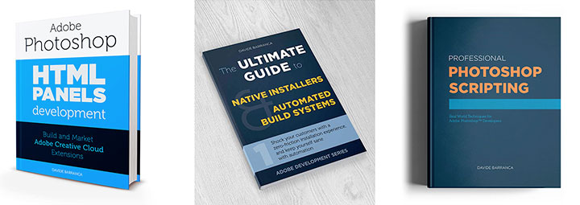
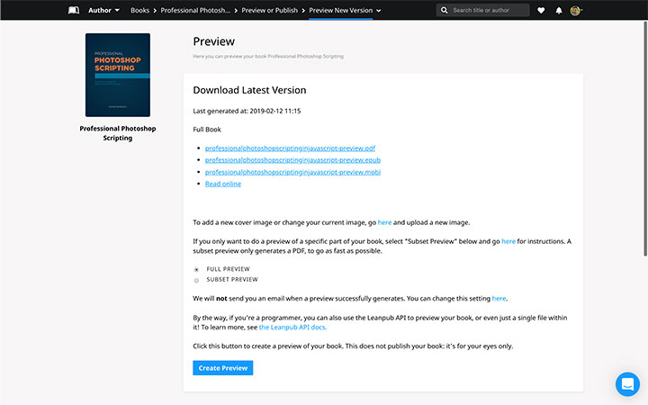
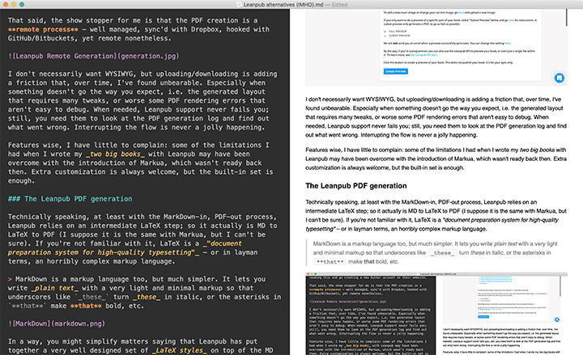
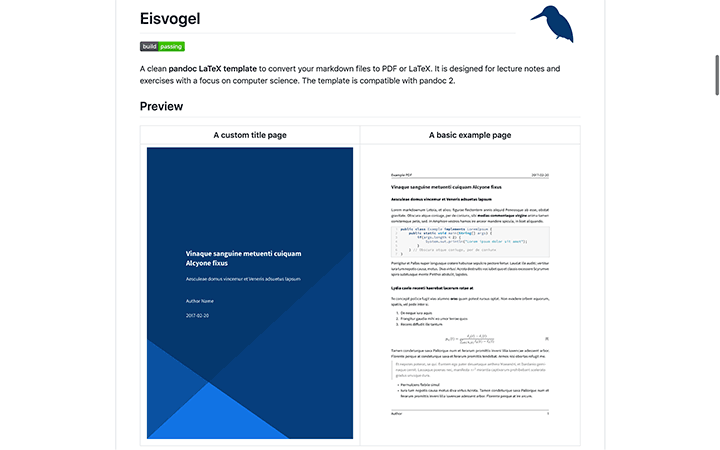
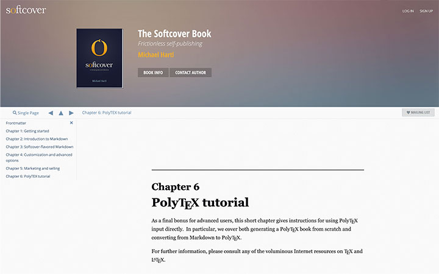
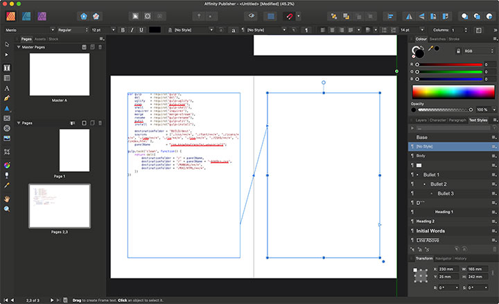
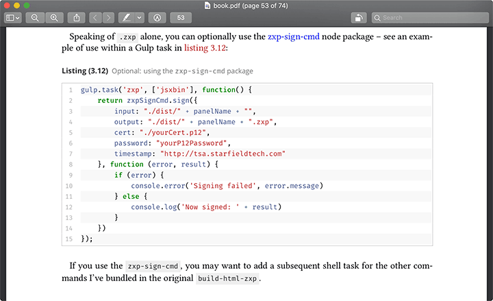

# Leanpub alternatives, IMHO

If you're into technical writing, read along. I've used Leanpub's services for two books of mine out of three, and I am still 100% sure that I couldn't make a better choice. 

But when you're more experienced, there might be reasons to look for alternatives: I'll tell you mine, how I've sorted my doubts out, and what I've eventually chosen. 

## TL;DR

Notable options among others are [Pandoc](https://pandoc.org/), [SoftCover](https://www.softcover.io/), [LaTeX](https://www.latex-project.org/), [Affinity Publisher](https://affinity.serif.com/en-gb/publisher/). Read along to see the piece of technology that I've embraced, and why.

## My own needs (which may differ from yours)

I am into technical publishing /  programming books: I've written three of them, that I refer to as _"the two big ones"_ (more than 350 pages, [Adobe Photoshop HTML Panels Development](https://www.htmlpanelsbook.com/) and [Professional Photoshop Scripting](https://www.ps-scripting.com)), and _"the short one"_ (less than 100 pages, [The Ultimate Guide to Native Installers and Automated Build Systems](https://www.davidebarranca.com/2018/01/ultimate-guide-native-installers-automated-build-system/)).

I do sell them on my own via [Gumroad](https://gumroad.com/); I do the marketing/newsletter on my own; I find beta readers / tech editors on my own; I do design the book on my own. Basically, I'm ever such a grumpy, control-freak guy with some tech background who needs to produce the best looking `.pdf` that he can. 

Stuff I very much like:

- Being able to customize the page design
- Relying on a repeatable, robust process
- Open source / offline tools
- Automated typesetting

Stuff I don't particularly need/like:

- Anything that goes beyond creating a PDF
- Online tools

To some extent, I can trade easiness for customizability because I do not write regularly: I embarque on big projects about once every couple of years, I am not willing to reinvent the wheel each time.

What follows is my personal quest for viable Leanpub alternatives: it is 100% based on my needs, skillset and amount of time I can currently devote on this. 

## Why am I looking for alternatives in the first place?

In my opinion, **Leanpub is by far the most usable, well crafted service on the market for ebook authors, and I couldn't recommend them more**. My _two big books_ have been produced by Leanpub, and could I go back in time I'd choose them again.

Not only they provide you with great tools for creating e-books, connecting authors with readers, managing sales, landing pages and the like, they are also heavily involved into advancing the industry with new standards such as [Markua](https://leanpub.com/markua/read) (a book-targeted, enhanced flavour of MarkDown). Lately, they have broaden their offer developing courses creation tools as well.

If you're tackling your first book, then Leanpub is a no brainer. Stop reading this and go creating a new Author account on their website.

That said, the show stopper for me is that the PDF creation is a **remote process** – well managed, sync'd with Dropbox, hooked with GitHub/Bitbuckets, yet remote nonetheless. 

I don't necessarily want WYSIWYG, but uploading/downloading is adding a friction that, over time, I've found unbearable. Especially when something doesn't go the way you expect, i.e. the generated layout that requires many tweaks, or worse some PDF rendering errors that aren't easy to debug. When needed, Leanpub support never fails you; still, you need them to look at the PDF generation log and find out what went wrong. Interrupting the flow is never a jolly happening.

Features wise, I have little to complain: some of the limitations I had when I wrote my _two big books_ with Leanpub may have been overcome with the introduction of Markua, which wasn't ready back then. Extra customization is always welcome, but the built-in set is enough.

### The Leanpub PDF generation

Technically speaking, at least with the MarkDown-in, PDF-out process, Leanpub relies on an intermediate LaTeX step; so it actually is MD to LaTeX to PDF (I suppose it is the same with Markua, but I can't be sure). If you're not familiar with it, LaTeX is a _"document preparation system for high-quality typesetting"_ – or in layman terms, an horribly complex markup language.

> MarkDown is a markup language too, but much simpler. It lets you write _plain text_ with a very light and minimal markup so that underscores like `_these_` turn _these_ in italic, or the asterisks in `**that**` make **that** bold, etc.
 

In a way, you might simplify matters saying that Leanpub has put together a very well designed set of _LaTeX styles_ on top of the MD conversion, so that the resulting PDF is remarkably good (setting aside `.epub` and `.mobi` versions, that are not a requirement for me).

### Leanpub's Pros and Cons

IMHO, on the plus side: writing in MarkDown is almost frictionless, the MD to PDF workflow frees your mind and lets you concentrate on producing content, Markua is a promising evolution, they offer a ton of marketing features.

IMHO, the cons: there is a limited set of available customizations, it's a paid service as it should be, above all the PDF generation doesn't happen locally but on their servers – which is the real obstacle for me.

## How I have evaluated alternatives

I am not the kind of guy who would write a book using Libre Office, and exporting it to PDF right away. It may be super handy for articles, yet I don't think it is up to the task for books. Or possibly it is, but either I am not familiar enough with it to deal with named cross-references, etc. or it is not a good fit for _programming_ books: e.g., my stuff involves a good deal of listings (programming code, mostly but not exclusively written in JavaScript) that require to be numbered and colored with proper syntax-highlighting, etc.

A tradeoff that I can bear: giving up some of the easiness that comes with writing-in-MarkDown-and-forget-about-everything-else, i.e. to decouple the writing from the typesetting processes. 

## Pandoc

[Pandoc](https://pandoc.org/) is an open source set of tools that let you convert between formats - a lot of them, including MarkDown,  ePub, Microsoft Word, InDesign `.idml`, PDF (via LaTeX). If you need it, you can get get a `.mobi` from an `.epub` with the help of [Calibre](https://calibre-ebook.com/).

Pandoc is super-awesome, it is free, it runs as a command-line utility from the Terminal for Mac, Win and Linux, it provides the same sort of MD to LaTeX to PDF workflow that Leanpub sports. There's an elephant in the room, though: you must rely on a set of custom _LaTeX styles_ to tweak the PDF appearance. In other words, the default conversion is elegant as almost any LaTeX document is by default, but rather dull: if you want to use some of the fancier stuff and you don't know your LaTeX... you're _totally_ out of luck.

Of course there is plenty of [templates](https://github.com/jgm/pandoc/wiki/User-contributed-templates). I did play a little bit with one called [Eisvogel](https://github.com/Wandmalfarbe/pandoc-latex-template), but I couldn't really figure out how to bend it to my needs, nor I did know how to "teach Pandoc" to interpret the MarkDown that I would like to be linked, say, to a custom LaTeX `\newcommand`s. 

In the end, I was facing two distinct and quite steep learning curves: getting the hang of LaTeX and Pandoc _at the same time_, I called quit.

## Softcover

I did use [SoftCover](https://www.softcover.io/) for my _short book_ a while ago, and I was quite pleased. Keeping it to the book generation process alone (Softcover offer sales services too), it is based on an open-source Ruby command-line set of tools to process MarkDown in, and output PDF, plus `.epub`, `.mobi`, and `.html`.

Softcover is more explicit in terms of intermediate steps, for it advocates the use of PolyTeX, _"a strict subset of the LaTeX typesetting language"_. Quite interestingly, you're allowed to mix-in some LaTeX in the MarkDown, that works in combination with the Softcover provided styles. The more LaTeX you know, the better you can customize them.

All in all, my experience with Softcover on the first book was OK. I had to tweak quite some things in the styles to match my taste, and I've copied and pasted from [TeX StackExchange](https://tex.stackexchange.com) more than a sensible developer would find appropriate – without really knowing what I was doing. Still, I did like more the Leanpub, out-of-the-box book design; on the plus side, I enjoyed very much the local PDF generation and PolyTeX features such as named cross-references.

> Since I've mentioned them a couple of times already, a _named cross reference_ is a piece of text (could be a title, a listing, a table, etc.) to which you attach a `\label`, and to which you can refer to with the same label. Magic happens because you automatically get both the correct numeration and name (here, "figure 1.2"). 

Unfortunately, when I got back to my one year old _short book_ markdown text to add some new content, the book generation failed, and spectacularly so. I couldn't get to the root of the problem in a decent amount of time – a Ruby version issue, some dependencies missing, who knows. That mishap did leave me with a vague "lack of robustness" feeling: had I used Softcover more frequently, I would have been able to steer the wheel and correct any small issue that, inevitably, presented itself over time. But after such a long hiatus, I felt that using a tool on which I hadn't full control was a bit of a gamble.

## Affinity Publisher

I am a true believer on [Affinity](https://affinity.serif.com)'s products lineup, so I've listed their Publisher instead of Adobe InDesign – even if I'm more familiar with the latter than the former[^publisher]. That is to say that I have evaluated the possibility to build the book "manually", with a page design application.

[^publisher]: Let's not forget that, to date, Affinity isn't Subscription based; and it has never, suddenly deleted a good deal of older versions of its softwares for licensing issues like Adobe recently did.

I must confess that, even if I would have enjoyed the possibility to get a live, visual feedback and pixel precision positioning, I tend to keep InDesign and its breed at an arm distance whenever possible (which, thanks to my job, is not always): I'm afraid I just don't like it. The idea to compose a short book, not to mention a long one, sounds dreadful to me.

Besides, listings are not so easy to typeset on Publisher: you'd need to copy the code from, say, Visual Studio Code, paste it on Pages/Word, copy it again and eventually paste inside a Text Frame to retain the RTF information – i.e. to keep the Syntax Highlighting. Which is a PITA for code maintenance and it doesn't really scale up when the book grows. I've logged a feature request for automated programming languages syntax highlighting on Affinity's forums, and I've moved on.

## LaTeX

Frankly, the idea of messing with master pages, character and paragraph styles, references, etc. on a page design application such as Affinity Publisher shedded a new, much brighter light on LaTeX. Which I started exploring. Given that I tend to fall in love with whatever piece of technology that you put in front of my nose, I did try to be realistic.

LaTeX is mostly used in academia, almost exclusively sciences and maths. It is known for providing an elegant typesetting out of the box, and equations so [beautifully drawn](https://www.nature.com/articles/d41586-019-01796-1) that mathematicians could stare at them for hours on end. 

Actually, it seems to have spread just because academic writers were such bad typesetters that they desperately needed some sort of tool that let them focus on the content only.

That said, it strikes me that among the many hundreds of packages (i.e. add-on features) available for LaTeX, all of them have documentation obviously written in LaTeX, and they kind of stink. Visually, I mean, which is quite ironic I suppose.

LaTeX is unfriendly to say the least: the learning curve is undoubtedly _steep_. For some reason, it seems like documentation is chiefly reference-based, with rare occasional examples. You can easily find yourself browsing for 7 years old replies on TeX StackExchange thinking: "Sweet, that is probably gonna work" (would it be a JavaScript library, a 7 months old reply has already a good chance to be outdated).

I subscribe 100% with the author of [The LaTeX Fetish (Or: Don’t write in LaTeX! It’s just for typesetting)](http://www.danielallington.net/2016/09/the-latex-fetish/), which has an interesting series of comments and replies. I could never write on LaTeX: it is too crowded, MarkDown is much less distracting. But I agree that LaTeX, a fossil from the past, still rocks as a typesetting tool.

So, I thought, if Pandoc, Softcover, and Leanpub are all LaTeX based; if I seem unable to just hack my way through them; wouldn't it be better if I started with the real thing from scratch? And so I did.

## My LaTeX journey

First, I've set a simple goal: re-typeset the _small book_, that you may remember was built with Softcover so I had both the MarkDown and the PolyTeX code available.

If you want to try LaTeX, head [here](https://www.latex-project.org/get/) and download the distribution for Mac, Win or Linux. Speaking of applications (IDEs so to speak), there are freewares such as [TeXstudio](https://texstudio.org/) or [TeXShop](https://pages.uoregon.edu/koch/texshop/), but I've found more user-friendly [Texpad](https://www.texpad.com/) (30$), or the free Visual Studio Code extension [LaTeX Workshop](https://github.com/James-Yu/LaTeX-Workshop).

I've started reading documentation and books: there are so many LaTeX Fetishists that manuals are abundant. In my experience, it is far better to start from a blank style (a file with a `.sty` extension) and add pieces one by onw, learning what they do as you insert them, instead of borrowing a complete style from somebody else and hack it to your taste. 

Line after line, I've merged pieces from `Softcover.sty`,  `Eisvogel.sty` and stuff I've found online; apparently there is a package for everything, from footnotes to listings, quotes, colors, bookmarks, you name it[^packages]. It would be impossible to list them all here – the bottom-line is that creating a decent set of styles for a book that is at least up to Leanpub standards is in fact a doable task for anyone with some inclination to code tinkering. Dare I to say, I've even got better listings :-) 

[^packages]: My understanding is that LaTeX is a macro-language on top of TeX, which is way too complex to be used right away. In addition to what comes built-in with LaTeX itself, you're usually advised to load _packages_: users contributed "macros" that makes the typesetting much easier.

At this point I cannot call myself a LaTeX expert at all, but for sure a better hacker: at least I am able to understand what is in the realm of my possibilities and what's better to keep away from. I've succeeded in re-typesetting my _short book_ in two/three night-time weeks, for which I'm quite pleased.

## What only time will tell

It is to be seen whether I will perceive LaTeX as a robust solution, i.e. will the same source, untouched, compile flawlessly one year from now, on a different machine? I have the feeling that such is the case, unless my cat sits on the keyboard when I'm off the desk. LaTeX is just markup after all, and it is so modular that I doubt it will all crash.

Now that I am slightly more acquainted with it, I may want to approach Pandoc again. No doubts that, as I've mentioned before, it's not a tool for writing but typesetting: I still miss the MarkDown to PDF conversion. If I can manage to create a template for Pandoc that takes into account all my listings styles and the like, I'll be the happiest camper.

## Conclusions

As it has already happened countless times to me, learning is rarely a direct path from point A to point B. I still have to find my dream workflow, but I think the one I've used – unless proven otherwise – is viable to say the least, and a good fit to the requirements I've set.

If you're a technical writer feel free to comment below, I'm eager to listen to your experience. Thanks for reading!

